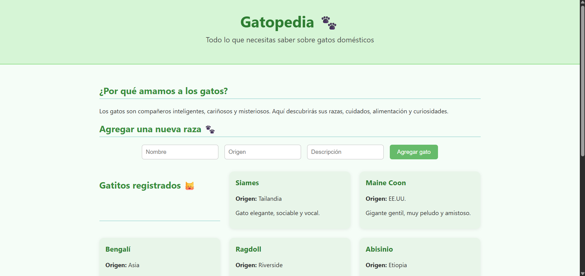

# 🐱 Gatopedia

Gatopedia es una pequeña aplicación web donde puedes aprender sobre razas de gatos domésticos, sus orígenes, cuidados y curiosidades. También puedes agregar nuevas razas a la base de datos mediante un formulario amigable.

---

## ✨ Características

- Diseño limpio y responsivo con HTML5 y CSS3.
- Lógica en JavaScript para conectarse con una API local (Flask).
- Permite agregar nuevas razas de gatos a través de un formulario.
- Listado dinámico de gatos ya registrados.

---

## 📂 Estructura del proyecto

Gatopedia/

- ├── index.html # Página principal
- ├── style/
- │ └── main.css # Estilos personalizados
- ├── add_cat.js # Lógica para cargar/agregar gatos
- └── README.md # Este archivo 😺

---

---

## 🚀 Cómo ejecutar

1. Asegúrate de tener corriendo una API local en `http://127.0.0.1:5000/gatos`.
2. Abre el archivo `index.html` en tu navegador.
3. Agrega una nueva raza y observa cómo se actualiza el listado.

---

## 🛠 Tecnologías usadas

- HTML5
- CSS3
- JavaScript
- Fetch API
- Flask (para el backend, no incluido en este repositorio)

---

## 🐾 Autora

Proyecto creado con amor por **Kelly** ❤️  
“Todo lo que necesitas saber sobre gatos domésticos.”

---

## 📸 Vista previa

---
